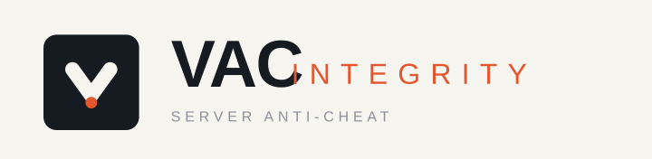

<p align="center">
  
</p>

<p align="center">
  <a href="https://github.com/text70/VAC/actions/workflows/rust-ci.yml"></a>
  
  
  
  
  <a href="https://docs.carbonmod.gg/"></a>
</p>

# VAC Integrity — Rust Server with VacIntegrity Anti-Cheat 

The Rust Linux server for Proton/Linux and Windows clients. 

RustDedicated + **Carbon** server with the **VAC Integrity**
anti-cheat stack layered in, deployable on your own machine (LAN or private
server). 

**Requirements for the server**
- **Host**: Debian/Ubuntu, Podman with internet connection

**What it provides**
- **Base image**: [didstopia/rust-server](https://hub.docker.com/r/didstopia/rust-server) (bundled in the podman/docker image)
- **Carbon Mod framework**: [Carbon.gg](https://carbonmod.gg) — [docs](https://docs.carbonmod.gg/) — [GitHub](https://github.com/CarbonCommunity/Carbon) (supports runtime `.cs` plugins such as VacIntegrity)
- **Built in Server Anti-cheat**: VacIntegrity plugin — [`libvac_integrity.so`](https://github.com/text70/VAC/tree/main/vac-server-integrity/vac-host) + PQC keys
- **Client Daemon**: Windows or Proton/Linux, downloaded from host server

## Links & references

- **Repository**: [github.com/text70/VAC](https://github.com/text70/VAC)
- **Deploy script**: [`deploy/deploy-didstopia.sh`](https://github.com/text70/VAC/blob/main/vac-server-integrity/deploy/deploy-didstopia.sh)
- **VacIntegrity plugin source**: [`vac-plugin/VacIntegrity.cs`](https://github.com/text70/VAC/blob/main/vac-server-integrity/vac-plugin/VacIntegrity.cs)
- **VAC Rust stack (daemon, native lib, modules)**: [`vac-server-integrity/`](https://github.com/text70/VAC/tree/main/vac-server-integrity)
- **EAC/LAN technical findings**: [`docs/lan-linux-eac-findings.md`](vac-server-integrity/docs/lan-linux-eac-findings.md)
- **Original Valve Anti-Cheat reverse-engineering**: [`docs/original-vac-re.md`](docs/original-vac-re.md)
- **Carbon**: [docs.carbonmod.gg](https://docs.carbonmod.gg/) · [GitHub](https://github.com/CarbonCommunity/Carbon)
- **Base image**: [didstopia/rust-server on Docker Hub](https://hub.docker.com/r/didstopia/rust-server) · [source](https://github.com/Didstopia/rust-server)

## Quickstart launch (curl from GitHub)

On a Debian/Ubuntu host with network access:

```bash
# As root (recommended — rootful podman):
sudo curl -sL https://raw.githubusercontent.com/text70/VAC/main/vac-server-integrity/deploy/deploy-didstopia.sh | \
  ADMIN_STEAMID=<your-steamid64> SERVER_IP=<your-server-ip> WORLDSIZE=<1000-4500> bash
```

> Timings: ~12 min one-time cargo build of the plugin stack on slow servers,
> then the first boot downloads the game via steamcmd (~5-15 min). Watch
> `podman logs -f rust-server` until `Server startup complete`.
>
> The script also works **rootless** (run without `sudo`): the data volume
> then lives in `~/vac-rustdata` instead of `/root/vac-rustdata`.

### Podman launch (equivalent)

The deploy script writes `launch.sh` into the data volume (installs the game
via steamcmd on first boot, loads Carbon/Doorstop, and drops to the image's
uid-1000 `docker` user when running under rootful podman) and starts:

```bash
podman run -d --name rust-server \
  -e WORLDSIZE=1000 -e VAC_SEED=<seed> \
  -e EXTRA_ARGS="+server.anticheattoken 0 +server.strictauth_eac 0 +server.authtimeout 3600 +server.encryption 0" \
  -e RCON_PASSWORD=secret -e VAC_PUBLIC_IP=<your-server-ip> \
  -v /root/vac-rustdata:/steamcmd/rust \
  -p 28015:28015/udp -p 28016:28016/tcp -p 28016:28016/udp \
  -p 28082:28082/tcp -p 28084:28084/tcp -p 28085:28085/tcp \
  --workdir / \
  --entrypoint /steamcmd/rust/launch.sh \
  docker.io/didstopia/rust-server:latest
```

> The volume must already contain `launch.sh`, the Carbon tree and the staged
> VacIntegrity artifacts — run the deploy script once instead of hand-rolling
> this command.


## Verify healthy

```bash
podman logs -f rust-server        # first boot: steamcmd install (~5-15 min), then "Server startup complete"
ss -lunp | grep 28016             # query port should LISTEN
curl -s http://127.0.0.1:28085/vac/status   # VAC plugin status (JSON)
```

## Deployment & environment variables

The same `deploy-didstopia.sh` runs on a LAN box **or** any Debian/Ubuntu cloud VM
(Hetzner, DigitalOcean, AWS, …), rootful (`sudo`) or rootless (plain user).
Everything is configured through environment variables on the deploy command
line. Data lives in `/root/vac-rustdata` (rootful) or `~/vac-rustdata`
(rootless); the VacIntegrity build cache lands next to it in `vacbuild`.

### Environment variables

| Env | Default | Meaning |
|-----|---------|---------|
| `SERVER_IP` | auto | IP advertised to players (maps to `VAC_PUBLIC_IP`). **Set the public IP on cloud hosts** |
| `VAC_PUBLIC_IP` | from `SERVER_IP` | IP baked into chat links, client packages, status page |
| `WORLDSIZE` | `1000` | map size (small = fast boot, low RAM) |
| `VAC_MAXPLAYERS` | via image | max players |
| `ADMIN_STEAMID` | unset | operator SteamID64 → owner/admin + SelectiveEAC bypass |
| `RCON_PASSWORD` | `vac-test` | RCON password — **change it** (exposed on 28016) |
| `ENABLE_CARBON` | `1` | install Carbon (0 = vanilla) |
| `VAC_DATA` | `/root/vac-rustdata` or `~/vac-rustdata` | host dir bound to `/steamcmd/rust` (game, saves, Carbon, keys) |
| `VAC_BUILD_DIR` | `/root/vacbuild` or `~/vacbuild` | host dir with prebuilt `libvac_integrity.so` + `vac-daemon` to stage (skips the build if complete) |
| `VAC_EXTRA_ARGS` | unset | extra `+cvar value ...` game args appended at launch |

Example (LAN):

```bash
sudo curl -sL https://raw.githubusercontent.com/text70/VAC/main/vac-server-integrity/deploy/deploy-didstopia.sh | \
  ADMIN_STEAMID=<your-steamid64> bash
```

> Tip: `VAC_PUBLIC_IP` is the only var the plugin reads directly; `WORLDSIZE`,
> `RCON`, etc. configure the game via the image startup args.

## Public hosting

Hosting on a cloud VPS only differs from a LAN box in two ways:

1. **Advertise the public IP.** On cloud the auto-detected IP is the interface's
   *private* address, which players can't reach. Always pass `SERVER_IP`.

```bash
sudo curl -sL https://raw.githubusercontent.com/text70/VAC/main/vac-server-integrity/deploy/deploy-didstopia.sh | \
  SERVER_IP=<your-cloud-public-ip> \
  ADMIN_STEAMID=<your-steamid64> \
  RCON_PASSWORD='<strong-password>' \
  bash
```

2. **Open the ports** in your provider's firewall / security group:

| Port | Protocol | Purpose |
|------|----------|---------|
| `28015` | UDP | game |
| `28016` | TCP + UDP | query / RCON |
| `28082` | TCP | Rust+ companion app |
| `28084` | TCP | VAC daemon listener |
| `28085` | TCP | installer / status page |

The deploy script passes `SERVER_IP` through as `VAC_PUBLIC_IP`, so chat links,
`/setup` and `/vac/status` all advertise the reachable public address instead of
the podman bridge IP.

### AWS security group (EC2)

Create a security group and open the five VAC ports. Replace `<VPC_ID>` with
your VPC id and confirm the rules to allow `0.0.0.0/0` (public players) or
restrict to your IP.

```bash
APP=vac-rust
SG_ID=$(aws ec2 create-security-group \
  --group-name "$APP-sg" --description "VAC Rust server" \
  --vpc-id <VPC_ID> --query GroupId --output text)

aws ec2 authorize-security-group-ingress --group-id "$SG_ID" \
  --ip-permissions '
    [
      {"IpProtocol":"udp","FromPort":28015,"ToPort":28015,"IpRanges":[{"CidrIp":"0.0.0.0/0"}]},
      {"IpProtocol":"tcp","FromPort":28016,"ToPort":28016,"IpRanges":[{"CidrIp":"0.0.0.0/0"}]},
      {"IpProtocol":"udp","FromPort":28016,"ToPort":28016,"IpRanges":[{"CidrIp":"0.0.0.0/0"}]},
      {"IpProtocol":"tcp","FromPort":28082,"ToPort":28082,"IpRanges":[{"CidrIp":"0.0.0.0/0"}]},
      {"IpProtocol":"tcp","FromPort":28084,"ToPort":28084,"IpRanges":[{"CidrIp":"0.0.0.0/0"}]},
      {"IpProtocol":"tcp","FromPort":28085,"ToPort":28085,"IpRanges":[{"CidrIp":"0.0.0.0/0"}]}
    ]'
```

Then attach it to the instance (replace `$INSTANCE_ID`):

```bash
aws ec2 modify-instance-attribute --instance-id $INSTANCE_ID \
  --groups "$SG_ID"
```

> Remember: an **Elastic IP** may be required (your public IP won't match
> `SERVER_IP` if you use an auto-assigned one that changes). Never pass your
> instance's *private* IP as `SERVER_IP`.

**Sizing (RAM ↔ world size):** an `m5.large`/`c6i.large`/`t3.large` (8GB) or
larger is recommended for `WORLDSIZE=4500`. A **`t3.medium` (4GB)** will OOM
on a 1500 map — use `WORLDSIZE=1000` there (the default, ~2GB peak, tested).
If the server dies right after "Occlusion Grid … Processing … batches" with
`Exiting..` in the logs, it's the engine being killed for memory — lower
`WORLDSIZE` (or raise the instance).

## Firewall (ufw — self-hosted)

Cloud hosts: open the five ports from the Public hosting table in your security
group. On a bare-metal/LAN box with `ufw`, run instead:

```bash
sudo ufw allow 28015/udp
sudo ufw allow 28016/tcp && sudo ufw allow 28016/udp
sudo ufw allow 28082/tcp
sudo ufw allow 28084/tcp && sudo ufw allow 28085/tcp
```

## Persistence / restart

```bash
podman start rust-server                       # after reboot
podman rm -f rust-server && <re-run script>    # rebuild; /root/vac-rustdata persists
```

## Clients

All clients should first install the RustClient.exe to Steam as a non-steam game. 

Games -> Add a Non-Steam Game to My Library -> Browse -> <path-to-your>SteamLibrary/steamapps/common/Rust/RustClient.exe

### Windows

1. In Steam, right-click **Rust → Properties → General → Launch Options**
2. Add the option exactly:
   ```
   -noeac
   ```
3. Close Properties; launch Rust from Steam via the **Play** button
   (launch options are only applied when launched through Steam, not by
   double-clicking `RustClient.exe`).

### Linux / Proton

1. Same as Windows: Steam → Rust → Properties → General → Launch Options →
   `-noeac`, then launch through the **Play** button (Proton passes the flag
   to `RustClient.exe`).

### Connecting in-game


1. Start the game and reach the main menu.
2. Press **F1** to open the in-game console.
3. Type, substituting your server IP, and press Enter:
   ```
   connect <SERVER_IP>:28015
   ```
4. You should load into the world. In the private chat you'll receive a
   **VAC access code** (and a download link for the Windows client).

> The same server works for vanilla / EAC-enabled Windows clients too, but on
> this EAC-off server the `-noeac` client is the intended pairing.

If you can't get the daemon in next part running in 60 seconds the sever will kick you. 
Go back to step 2. and rejoin the server. 

### Installing & running the VAC daemon (Linux client)

The vac-daemon binary is downloaded with the encrypted server signature from the Rust server.  
  
The magic launch link auto-detects your OS: a Windows browser gets the
`vac-setup.zip` installer, a Linux/Proton User-Agent gets
`vac-linux.zip` (the `vac-daemon` binary + a preload ini with your access
code). Alternatively download the daemon directly into the directory of your choice:

```bash
wget http://<SERVER_IP>:28085/vac-daemon -O vac-daemon
chmod +x vac-daemon
./vac-daemon <SERVER_IP>:28084 <steamid64> <code-from-chat>
```

- `<SERVER_IP>` — the server's IP (`28084` = daemon listener)
- `<steamid64>` — your SteamID64
- `<code-from-chat>` — the access code the plugin gave you in game

On launch if the game is not connected, you will get a reject message, once connected this
message should go change.  

Keep the daemon running in a terminal during gameplay (it auto-reconnects).   

You can check your live status at:
`http://<SERVER_IP>:28085/vac/status`

> The command above downloads to your current directory (`vac-daemon`) and runs
> it with `./vac-daemon`. If you save it elsewhere (e.g. `~/vac-daemon`), run it
> with that path instead. Prefer the `vac-linux.zip` from your chat link, which
> bakes in your server address and access code so you don't have to type them.

### Installing & running the VAC daemon (Windows client)

Windows doesn't ship `wget`, so use PowerShell's `Invoke-WebRequest`. The server
auto-detects your OS and serves the Windows **installer zip** (never the raw
Linux binary). Either click the chat link, or run:

```powershell
Invoke-WebRequest "http://<SERVER_IP>:28085/setup?t=<code-from-chat>" -OutFile vac-setup.zip
```

Then:
1. Extract `vac-setup.zip` and run `vac-setup.exe`.
2. The installer pre-fills your server address and access code (from the link's
   `t=<code>`), so just click through.
3. Keep the VAC daemon running (it runs as a background service).

If you have `wget` installed (e.g. Git for Windows), this works too:
```powershell
wget "http://<SERVER_IP>:28085/setup?t=<code-from-chat>" -o vac-setup.zip
```

- `<SERVER_IP>` — the server's IP (e.g. `10.0.0.6`)
- `<code-from-chat>` — the access code the plugin gave you in game

You can check your live status at:
`http://<SERVER_IP>:28085/vac/status`


## Notes
- Server-side EAC is off (`server.encryption 0`) — private/LAN only.
- **Carbon `.cs` plugins compile at runtime on this base** (verified:
  VacIntegrity loads as a `.cs` plugin). 
- See [`vac-server-integrity/docs/lan-linux-eac-findings.md`](vac-server-integrity/docs/lan-linux-eac-findings.md) for
  the full technical history of the EAC/LAN work.

## Admin panel & auth

- In-game, open the Carbon admin panel by typing **`cpanel`** (without the
  leading `/`) in chat.
- The setup operator is automatically registered as admin/moderator via the
  deploy script.
</content>
